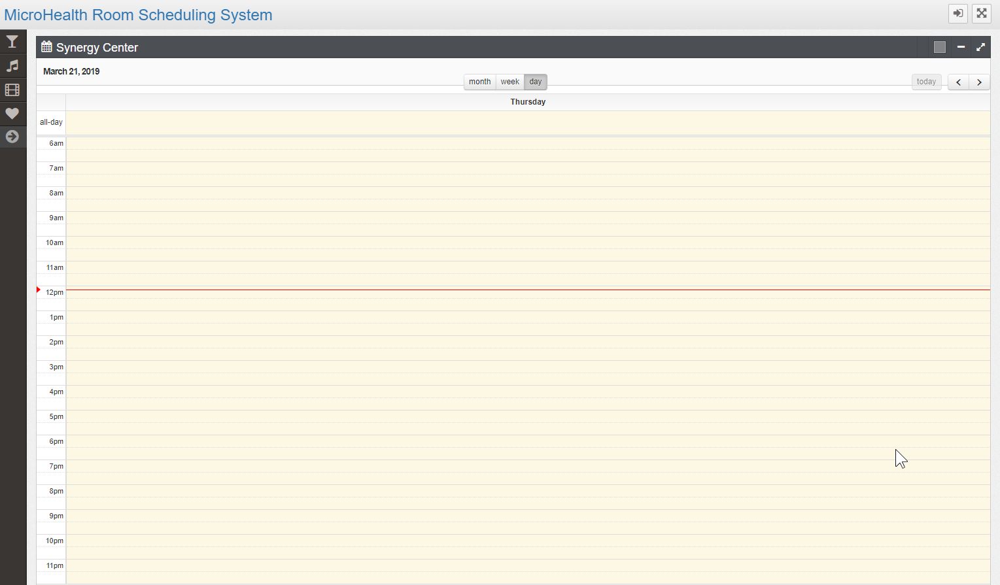
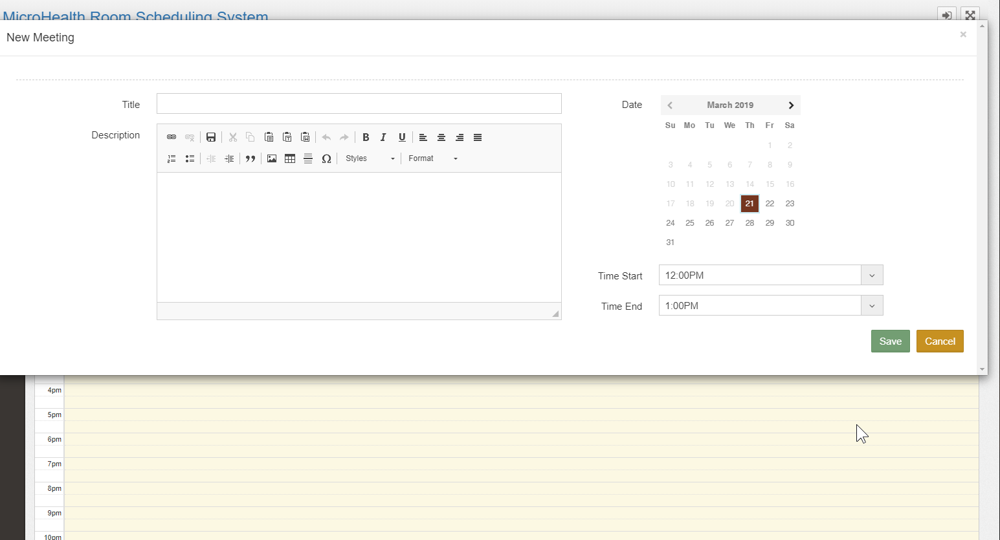

# mRSS  
This is a really simple calendaring system...works well on chrome based browsers.  Intended to be run on a tablet, we run it on ipads and have them installed next to conference rooms.  Users can book the conference room at the room or online.  There is an admin screen to setup the room and brand the system.  We wanted something really simple...as easy as it gets for users allowing them to book daily, weekly, biweekly, monthly etc etc without connecting it to other systems.  That brings a bit of complexity to users who have to authenticate to book a room.  Users just didn't do that so we simplified it as much as possible.

# update centos

yum update

yum install -y epel-release yum-utils

yum-config-manager --enable epel

yum clean all && sudo yum update -y

# install ruby

gpg --keyserver hkp://keys.gnupg.net --recv-keys 409B6B1796C275462A1703113804BB82D39DC0E3

curl -sSL https://get.rvm.io | sudo bash -s stable

usermod -a -G rvm `username'

export PATH="$PATH:$HOME/.rvm/bin"

log out then log back in

rvm install ruby-2.3.6

rvm install ruby-devel-2.3.6

bash -l -c "rvm use 2.3.6 --default"

# Install Mysql
yum install mariadb-server mariadb

yum install mysql-devel

systemctl start mariadb

systemctl enable mariadb

mysql_secure_installation

mysql -u root -p

create database mrss_prod CHARACTER SET utf8 COLLATE utf8_general_ci;

exit

# be sure git is installed
yum install git

# go to /var/www and from there 
cd /var/www/

git clone https://github.com/iFixtechLLC/mRSS

nano /var/www/mRSS/config/database.yml

--enter the password for mysql where it says password then save and exit

# go to the cloned directory 
cd /var/www/mRSS 

gem install rails

gem install bundler

yum install nodejs

bundle install

rails db:setup 

rake assets:precompile

# generate your secrets for config/secrets.yml

rake secret

put that output in config/secretys.yml

# Configure Nginx repo for CentOS 7

nano /etc/yum.repos.d/nginx.repo

# then enter this below and save

[nginx]

name=nginx repo

baseurl=http://nginx.org/packages/mainline/centos/7/$basearch/

gpgcheck=0

enabled=1

# Update yum and install nginx
yum update

yum install -y nginx

sudo systemctl enable nginx

# install passenger phusion

yum install -y pygpgme curl

curl --fail -sSLo /etc/yum.repos.d/passenger.repo https://oss-binaries.phusionpassenger.com/yum/definitions/el-passenger.repo

yum install -y nginx passenger || sudo yum-config-manager --enable cr && sudo yum install -y nginx passenger

# then go edit passenger.conf
nano /etc/nginx/conf.d/passenger.conf

# -where it says passenger_ruby change what you see there to what you see below.  If that doesn't work then do this "which passenger-config" to get the path to put next to passenger_ruby

passenger_ruby /usr/local/rvm/gems/ruby-2.3.6/wrappers/ruby;

--uncomment the line above and the line below along with the passenger_ruby line e.g. remove this"#"

echo fs.inotify.max_user_watches=524288 | sudo tee -a /etc/sysctl.conf && sudo sysctl -p

# edit nginx.conf
nano /etc/nginx/nginx.conf
add these

        passenger_enabled on;
        rails_env production;

# restart nginx
service nginx restart

# Setup page
https://your-url/settings

login with the temporary username admin with password Admin@2019

Change configure and customize your app
